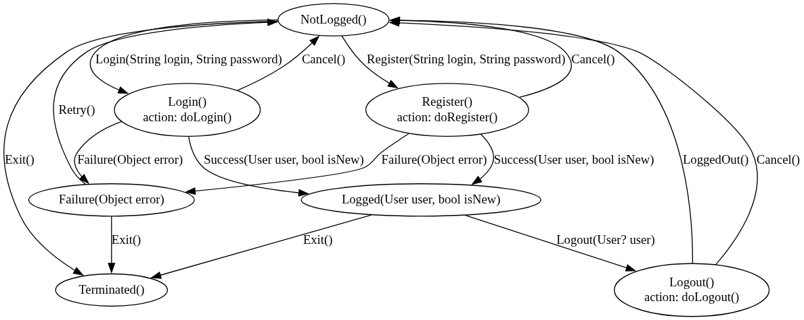

# state_machine_generator

Finite state machine source code generator. Graphviz, Mermaid visualizations. Automatic generation of commands available for different states. FSM generation for any purpose.

[](https://pub.dev/packages/state_machine_generator)
[](https://pub.dev/packages/state_machine_generator/score)
[](https://github.com/mezoni/state_machine_generator/issues)
[](https://github.com/mezoni/state_machine_generator/forks)
[](https://github.com/mezoni/state_machine_generator/stargazers)
[](https://raw.githubusercontent.com/mezoni/state_machine_generator/main/LICENSE)

## About this software

Finite state machine source code generator. Graphviz, Mermaid visualizations. Automatic generation of commands available for different states. FSM generation for any purpose.

Advantages:

- Easy to model, verify and debug the state machines being developed
- Strict validation during the building process of the state machine
- Conversion to `Graphviz` or `Mermaid` visualization tools
- High transition speed, independent of the number of states
- Can be used in high-load systems
- Synchronous automaton for asynchronous operations
- The `guard` conditions are supported

Disadvantages:

- Source code generation of the state machine required
- Hierarchically nested states are not supported
- Orthogonal regions are not supported

The source code generation comes from special configuration classes.  
Creating configuration classes is possible directly or by converting from other formats.  

## Modeling and source code generation

The state machine source code is generated from special configuration classes.  
List of configuration classes:

- `Event`
- `State`
- `StateMachine`
- `Transition`

These classes are very primitive and the understanding of their meaning can be found in the description of these classes.  
State machine modeling can be done directly using these classes or using various convenient tools at the discretion of the developer. For example, `StateMachineBuilder`, `StatePathChecker` or other self-written ones.

The `StateMachineGenerator` class is intended for generating source code of the state machine.

Theoretically, modeling can be performed in visual development environments with subsequent transformation.  
At the moment, this software does not provide any converters for such purposes.

## Example

An example of a simple state machine model can be found in the `example` directory.  

State machine diagram



[Graphviz example](https://github.com/mezoni/state_machine_generator/blob/main/example/example.dot)

```txt
digraph AuthMachine {
  NotLogged [ label="NotLogged()"]
  Login [ label="Login()\naction: doLogin()"]
  NotLogged -> Login [label="Login(String login\, String password)"]
  Logged [ label="Logged(User user, bool isNew)"]
  Login -> Logged [label="Success(User user\, bool isNew)"]
  Failure [ label="Failure(Object error)"]
  Login -> Failure [label="Failure(Object error)"]
  Register [ label="Register()\naction: doRegister()"]
  NotLogged -> Register [label="Register(String login\, String password)"]
  Register -> Logged [label="Success(User user\, bool isNew)"]
  Register -> Failure [label="Failure(Object error)"]
  Logout [ label="Logout()\naction: doLogout()"]
  Logged -> Logout [label="Logout(User? user)"]
  Logout -> NotLogged [label="LoggedOut()"]
  Failure -> NotLogged [label="Retry()"]
  Terminated [ label="Terminated()"]
  Failure -> Terminated [label="Exit()"]
  Logged -> Terminated [label="Exit()"]
  NotLogged -> Terminated [label="Exit()"]
  Login -> NotLogged [label="Cancel()"]
  Register -> NotLogged [label="Cancel()"]
  Logout -> NotLogged [label="Cancel()"]
}

```

[Mermaid  example](https://github.com/mezoni/state_machine_generator/blob/main/example/example.mermaid)

```txt
stateDiagram-v2
  NotLogged : NotLogged()
  Login : Login()<br/>action: doLogin()
  NotLogged --> Login : Login(String login\, String password)
  Logged : Logged(User user\, bool isNew)
  Login --> Logged : Success(User user\, bool isNew)
  Failure : Failure(Object error)
  Login --> Failure : Failure(Object error)
  Register : Register()<br/>action: doRegister()
  NotLogged --> Register : Register(String login\, String password)
  Register --> Logged : Success(User user\, bool isNew)
  Register --> Failure : Failure(Object error)
  Logout : Logout()<br/>action: doLogout()
  Logged --> Logout : Logout(User? user)
  Logout --> NotLogged : LoggedOut()
  Failure --> NotLogged : Retry()
  Terminated : Terminated()
  Failure --> Terminated : Exit()
  Logged --> Terminated : Exit()
  NotLogged --> Terminated : Exit()
  Login --> NotLogged : Cancel()
  Register --> NotLogged : Cancel()
  Logout --> NotLogged : Cancel()

```

[Simulation example of using a state machine](https://github.com/mezoni/state_machine_generator/blob/main/example/_use_example.dart)

```dart
import 'dart:async';

import '_auth_service.dart';
import 'example.dart';

void main(List<String> args) {
  _fsm.onStateChange(_listen);

  final events = [
    LoginEvent(login: 'user', password: '123'),
    const RetryEvent(),
    RegisterEvent(login: 'user', password: '123'),
    RegisterEvent(login: 'user', password: '123'),
    LogoutEvent(user: _user),
    LogoutEvent(user: _user),
    RegisterEvent(login: 'user', password: '123'),
    const RetryEvent(),
    LoginEvent(login: 'user', password: '123'),
    LogoutEvent(user: _user),
    const ExitEvent(),
  ];

  var isStateChanged = false;

  _fsm.onStateChange((state) {
    isStateChanged = true;
  });

  Timer.periodic(Duration(seconds: 4), (timer) {
    if (!isStateChanged) {
      print("State '${_fsm.state}' not changed");
    }

    print('User: $_user');

    final index = timer.tick - 1;
    if (index >= events.length) {
      timer.cancel();
      return;
    }

    isStateChanged = false;
    final event = events[index];
    _sendEvent(event);
  });
}

final _fsm = _Fsm();

User? _user;

void _listen(AuthState state) {
  print('-' * 40);
  print('State: $state');
  _notifyStateChanged(state);
  switch (state) {
    case final FailureState state:
      print('Error: ${state.error}');
      break;
    case final LoggedState state:
      final isNew = state.isNew;
      final user = state.user;
      final text = isNew
          ? 'Hello, $user! You have successfully registered'
          : 'Hello, $user!';
      _user = user;
      print(text);
      break;
    case LoginState():
      print('Logging...');
      break;
    case LogoutState():
      print('Logging out...');
      break;
    case NotLoggedState():
      _user = null;
      break;
    case RegisterState():
      print('Registering...');
    case TerminatedState():
      print('Good bye');
  }
}

void _notifyStateChanged(AuthState state) {
  // Add your logic
}

void _sendEvent(AuthEvent event) {
  Timer.run(() {
    print('SEND_EVENT: $event');
    _fsm.processEvent(event);
  });
}

class _Fsm extends AuthMachine {
  @override
  void doLogin(LoginEvent e) {
    var isCanceled = false;
    onCancel = () => isCanceled = true;
    Timer.run(() async {
      try {
        final user = await AuthService().login(e.login, e.password);
        if (!isCanceled) {
          processEvent(SuccessEvent(user: user, isNew: false));
        }
      } catch (e) {
        if (!isCanceled) {
          processEvent(FailureEvent(error: e));
        }
      }
    });
  }

  @override
  void doLogout(LogoutEvent event) {
    var isCanceled = false;
    onCancel = () => isCanceled = true;
    Timer.run(() async {
      try {
        final user = event.user;
        await AuthService().logout(user);
      } catch (_) {}
      if (!isCanceled) {
        processEvent(LoggedOutEvent());
      }
    });
  }

  @override
  void doRegister(RegisterEvent event) {
    var isCanceled = false;
    onCancel = () => isCanceled = true;
    Timer.run(() async {
      try {
        final user = await AuthService().register(event.login, event.password);
        if (!isCanceled) {
          processEvent(SuccessEvent(user: user, isNew: true));
        }
      } catch (e) {
        if (!isCanceled) {
          processEvent(FailureEvent(error: e));
        }
      }
    });
  }
}

```

Result of simulation:

```txt
State 'NotLogged' not changed
User: null
SEND_EVENT: Login
----------------------------------------
State: Login
Logging...
----------------------------------------
State: Failure
Error: Bad state: Invalid login or password
User: null
SEND_EVENT: Retry
----------------------------------------
State: NotLogged
User: null
SEND_EVENT: Register
----------------------------------------
State: Register
Registering...
----------------------------------------
State: Logged
Hello, user! You have successfully registered
User: user
SEND_EVENT: Register
State 'Logged' not changed
User: user
SEND_EVENT: Logout
----------------------------------------
State: Logout
Logging out...
----------------------------------------
State: NotLogged
User: null
SEND_EVENT: Logout
State 'NotLogged' not changed
User: null
SEND_EVENT: Register
----------------------------------------
State: Register
Registering...
----------------------------------------
State: Failure
Error: Bad state: User 'user' already exists
User: null
SEND_EVENT: Retry
----------------------------------------
State: NotLogged
User: null
SEND_EVENT: Login
----------------------------------------
State: Login
Logging...
----------------------------------------
State: Logged
Hello, user!
User: user
SEND_EVENT: Logout
----------------------------------------
State: Logout
Logging out...
----------------------------------------
State: NotLogged
User: null
SEND_EVENT: Exit
----------------------------------------
State: Terminated
Good bye
User: null

```

[CLI example of using a state machine](https://github.com/mezoni/state_machine_generator/blob/main/example/_run_example.dart)

```dart
import 'dart:async';
import 'dart:io';

import '_auth_service.dart';
import '_cli_utils.dart';
import 'example.dart';

Future<void> main(List<String> args) async {
  _fsm.onStateChange(_listen);
  _fsm.onStateChange(_handleCancel);
  // init _cancelSub
  _cancelSub;
  _onStateChange(_fsm.state);
}

final _cancelSub = stdin.listen((event) {
  // Handle 'enter' as cancel event
  if (!_isCancelAllowed ||
      event.isEmpty ||
      event.length != 1 ||
      event[0] != 10) {
    return;
  }

  print('Cancelling...');
  _processEvent(const CancelEvent());
});

final _fsm = _Fsm();

bool _isCancelAllowed = false;

User? _user;

void _handleCancel(AuthState state) {
  _isCancelAllowed = false;
  final commands = _fsm.getCommands(state);
  for (var i = 0; i < commands.length; i++) {
    final command = commands[i];
    if (command == AuthCommand.cancel) {
      _isCancelAllowed = true;
      break;
    }
  }
}

void _listen(AuthState state) {
  Timer.run(() => _onStateChange(state));
}

void _notifyAboutCancel(AuthState state) {
  if (_fsm.getCommands(state).contains(AuthCommand.cancel)) {
    print("Press 'enter' to cancel");
  }
}

void _onStateChange(AuthState state) {
  print('=== $state ===');
  switch (state) {
    case final FailureState state:
      final error = state.error;
      print('Error: $error');
      break;
    case final LoggedState state:
      _user = state.user;
      final isNew = state.isNew;
      if (isNew) {
        print('Hello, $_user. You have successfully registered');
      } else {
        print("Logged as '$_user'");
      }

      break;
    case LoginState():
      print('Logging...');
      print("This will take 3 seconds");
      break;
    case LogoutState():
      print('Logging out...');
      print("This will take 3 seconds");
      break;
    case NotLoggedState():
      break;
    case RegisterState():
      print('Registering...');
      print("This will take 5 seconds");
      break;
    case TerminatedState():
      print('Terminated');
      _cancelSub.cancel().ignore();
      break;
  }

  _notifyAboutCancel(state);
  _processState(state);
}

void _processEvent(AuthEvent event) {
  Timer.run(() => _fsm.processEvent(event));
}

void _processState(AuthState state) {
  final commands = _fsm.getCommands(state);
  if (commands.isEmpty) {
    return;
  }

  final current = <(String, AuthCommand)>[];
  for (var i = 0; i < commands.length; i++) {
    final command = commands[i];
    if (command == AuthCommand.cancel) {
      // With blocking, synchronous 'stdin' processing 'cancel' does not come here
      continue;
    }

    current.add((command.fullName, command));
  }

  if (current.isEmpty) {
    return;
  }

  while (true) {
    final command = readCommand(current);
    switch (command) {
      case AuthCommand.cancel:
        _processEvent(const CancelEvent());
        return;
      case AuthCommand.exit:
        _processEvent(const ExitEvent());
        return;
      case AuthCommand.login:
        final text = prompt('Enter login and password');
        final parts = toWords(text);
        if (parts.length != 2) {
          continue;
        }

        final login = parts[0];
        final password = parts[1];
        _processEvent(LoginEvent(login: login, password: password));
        return;
      case AuthCommand.logout:
        final user = _user;
        _processEvent(LogoutEvent(user: user));
        return;
      case AuthCommand.register:
        final text = prompt('Enter login and password');
        final parts = toWords(text);
        if (parts.length != 2) {
          continue;
        }

        final login = parts[0];
        final password = parts[1];
        _processEvent(RegisterEvent(login: login, password: password));
        return;
      case AuthCommand.retry:
        _processEvent(const RetryEvent());
        return;
    }
  }
}

class _Fsm extends AuthMachine {
  @override
  void doLogin(LoginEvent e) {
    var isCanceled = false;
    onCancel = () => isCanceled = true;
    Timer.run(() async {
      try {
        final user = await AuthService().login(e.login, e.password);
        if (!isCanceled) {
          processEvent(SuccessEvent(user: user, isNew: false));
        }
      } catch (e) {
        if (!isCanceled) {
          processEvent(FailureEvent(error: e));
        }
      }
    });
  }

  @override
  void doLogout(LogoutEvent event) {
    var isCanceled = false;
    onCancel = () => isCanceled = true;
    Timer.run(() async {
      try {
        final user = event.user;
        await AuthService().logout(user);
      } catch (_) {}
      if (!isCanceled) {
        processEvent(LoggedOutEvent());
      }
    });
  }

  @override
  void doRegister(RegisterEvent event) {
    var isCanceled = false;
    onCancel = () => isCanceled = true;
    Timer.run(() async {
      try {
        final user = await AuthService().register(event.login, event.password);
        if (!isCanceled) {
          processEvent(SuccessEvent(user: user, isNew: true));
        }
      } catch (e) {
        if (!isCanceled) {
          processEvent(FailureEvent(error: e));
        }
      }
    });
  }
}

```

[An example of generating a state machine](https://github.com/mezoni/state_machine_generator/blob/main/example/_generate_example.dart)

```dart
import 'package:state_machine_generator/state_machine.dart';
import 'package:state_machine_generator/state_machine_builder.dart';
import 'package:state_machine_generator/state_path_checker.dart';

import '_build_utils.dart';

void main(List<String> args) {
  const initialStateName = 'NotLogged';
  final b = StateMachineBuilder(
    initialState: initialStateName,
  );

  b.addState('Failure', parameters: {'error': 'Object'});
  b.addState('Logged', parameters: {'user': 'User', 'isNew': 'bool'});
  b.addState('Login', hasAction: true);
  b.addState('Logout', hasAction: true);
  b.addState('NotLogged');
  b.addState('Register', hasAction: true);
  b.addState('Terminated');

  b.addEvent('Cancel', isCommand: true);
  b.addEvent('Exit');
  b.addEvent('Failure', parameters: {'error': 'Object'});
  b.addEvent('Login', parameters: {'login': 'String', 'password': 'String'});
  b.addEvent('Logout', parameters: {'user': 'User?'});
  b.addEvent('LoggedOut');
  b.addEvent('Register', parameters: {'login': 'String', 'password': 'String'});
  b.addEvent('Retry');
  b.addEvent('Success', parameters: {'user': 'User', 'isNew': 'bool'});

  const transitionSource = '''
# Login successful
NotLogged .Login Login .Success Logged

# Login failed
NotLogged .Login Login .Failure Failure

# Registering successful
NotLogged .Register Register .Success Logged

# Registering failed
NotLogged .Register Register .Failure Failure

# Logout
Logged .Logout Logout .LoggedOut NotLogged

# Retry
Failure .Retry NotLogged
''';

  const pathSource = '''
# Login succeeded
NotLogged Login Logged

# Login failed
NotLogged Login Failure NotLogged

# Registration succeeded
NotLogged Register Logged

# Registration failed
NotLogged Register Failure NotLogged

#  Logout
Logged Logout NotLogged

# Reset
Failure NotLogged
''';

  addTransitions(b, transitionSource);

  // Example of adding 'terminated' state
  const terminated = 'Terminated';
  // Exclude states that execute actions at the state machine level.
  final excludedStates = b.transitions.values
      .where((e) => e.source.hasAction)
      .map((e) => e.source.name)
      .toSet();
  for (final state in b.states) {
    final name = state.name;
    if (name == terminated || excludedStates.contains(name)) {
      continue;
    }

    b.addTransition(from: name, on: 'Exit', to: terminated);
  }

  // Example of adding 'cancel' event
  const cancel = 'Cancel';
  // Add for states that execute actions at the state machine level.
  for (final state in excludedStates) {
    b.addTransition(from: state, on: cancel, to: initialStateName);
  }

  final (:initialState, :transitions) = b.build();

  final pathChecker = StatePathChecker(transitions: transitions);
  addStatePaths(pathChecker, pathSource);
  pathChecker.check();

  const name = 'Auth';
  final stateMachine = StateMachine(
    commandType: '${name}Command',
    eventType: '${name}Event',
    initialState: initialState,
    globals: _globals,
    name: '${name}Machine',
    stateType: '${name}State',
    transitions: transitions,
  );

  writeFiles(stateMachine, 'example/example');
}

const _globals = '''
// ignore_for_file: unused_local_variable
import '_auth_service.dart';
''';

```

[An example of generated a state machine](https://github.com/mezoni/state_machine_generator/blob/main/example/example.dart)

```dart
// ignore_for_file: unused_local_variable
import '_auth_service.dart';

/// [AuthCommand] a set of commands that can be used with [AuthMachine]
enum AuthCommand {
  cancel('Cancel'),
  exit('Exit'),
  login('Login'),
  logout('Logout'),
  register('Register'),
  retry('Retry');

  const AuthCommand(this.fullName);

  final String fullName;
}

sealed class AuthEvent {
  const AuthEvent();

  int get $index;
}

final class CancelEvent extends AuthEvent {
  const CancelEvent();

  @override
  int get $index => 0;

  @override
  String toString() => 'Cancel';
}

final class ExitEvent extends AuthEvent {
  const ExitEvent();

  @override
  int get $index => 1;

  @override
  String toString() => 'Exit';
}

final class FailureEvent extends AuthEvent {
  final Object error;

  const FailureEvent({required this.error});

  @override
  int get $index => 2;

  @override
  String toString() => 'Failure';
}

final class LoggedOutEvent extends AuthEvent {
  const LoggedOutEvent();

  @override
  int get $index => 3;

  @override
  String toString() => 'LoggedOut';
}

final class LoginEvent extends AuthEvent {
  final String login;

  final String password;

  const LoginEvent({
    required this.login,
    required this.password,
  });

  @override
  int get $index => 4;

  @override
  String toString() => 'Login';
}

final class LogoutEvent extends AuthEvent {
  final User? user;

  const LogoutEvent({required this.user});

  @override
  int get $index => 5;

  @override
  String toString() => 'Logout';
}

final class RegisterEvent extends AuthEvent {
  final String login;

  final String password;

  const RegisterEvent({
    required this.login,
    required this.password,
  });

  @override
  int get $index => 6;

  @override
  String toString() => 'Register';
}

final class RetryEvent extends AuthEvent {
  const RetryEvent();

  @override
  int get $index => 7;

  @override
  String toString() => 'Retry';
}

final class SuccessEvent extends AuthEvent {
  final User user;

  final bool isNew;

  const SuccessEvent({
    required this.user,
    required this.isNew,
  });

  @override
  int get $index => 8;

  @override
  String toString() => 'Success';
}

sealed class AuthState {
  const AuthState();

  int get $index;
}

final class FailureState extends AuthState {
  final Object error;

  const FailureState({required this.error});

  @override
  int get $index => 0;

  @override
  String toString() => 'Failure';
}

final class LoggedState extends AuthState {
  final User user;

  final bool isNew;

  const LoggedState({
    required this.user,
    required this.isNew,
  });

  @override
  int get $index => 1;

  @override
  String toString() => 'Logged';
}

final class LoginState extends AuthState {
  const LoginState();

  @override
  int get $index => 2;

  @override
  String toString() => 'Login';
}

final class LogoutState extends AuthState {
  const LogoutState();

  @override
  int get $index => 3;

  @override
  String toString() => 'Logout';
}

final class NotLoggedState extends AuthState {
  const NotLoggedState();

  @override
  int get $index => 4;

  @override
  String toString() => 'NotLogged';
}

final class RegisterState extends AuthState {
  const RegisterState();

  @override
  int get $index => 5;

  @override
  String toString() => 'Register';
}

final class TerminatedState extends AuthState {
  const TerminatedState();

  @override
  int get $index => 6;

  @override
  String toString() => 'Terminated';
}

abstract class AuthMachine {
  /// State action that implemented at the machine-level should subscribe to the
  /// internal `cancel action event` using this variable.
  ///
  /// A `cancel action event` always occurs if the current state performs an
  /// action at the machine-level and the state machine needs to exit the
  /// current state to make the transition.
  ///
  /// The subscription must be made in the action method, each time it is
  /// called.
  ///
  /// The subscriber will be called by the state machine to notify that the
  /// action needs to be cancelled.\
  /// When a notification is received, the subscriber must return control to
  /// the state machine as quickly as possible.
  ///
  /// From the moment of receipt of the notification, the action must consider
  /// itself cancelled.\
  /// The canceled action must not trigger any events.
  /// If an action performs any operations, it must asynchronously cancel these
  /// operations.
  ///
  /// Example:
  ///
  /// ```dart
  /// @override
  /// void doLogging(LoginEvent e) {
  ///   var isCanceled = false;
  ///   onCancel = () => isCanceled = true;
  ///   Timer.run(() async {
  ///     try {
  ///       final user = await AuthService().login(e.login, e.password);
  ///       if (!isCanceled) {
  ///         processEvent(SuccessEvent(user: user, isNew: false));
  ///       }
  ///     } catch (e) {
  ///       if (!isCanceled) {
  ///         processEvent(FailureEvent(error: e));
  ///       }
  ///     }
  ///   });
  /// }
  /// ```
  void Function()? onCancel;

  AuthState _state = const NotLoggedState();

  final List<void Function(AuthState)> _stateListeners = [];

  /// Returns the current state of the state machine.
  AuthState get state => _state;

  void doLogin(LoginEvent event);

  void doRegister(RegisterEvent event);

  void doLogout(LogoutEvent event);

  List<AuthCommand> getCommands(AuthState state) {
    final s = state.$index;
    if (s < 3) {
      if (s < 1) {
        if (s == 0) {
          // State: Failure
          return const [AuthCommand.retry, AuthCommand.exit];
        }
      } else if (s > 1) {
        // State: Login
        return const [AuthCommand.cancel];
      } else {
        // State: Logged
        return const [AuthCommand.logout, AuthCommand.exit];
      }
    } else if (s > 3) {
      if (s < 5) {
        // State: NotLogged
        return const [AuthCommand.login, AuthCommand.register, AuthCommand.exit];
      } else if (s == 5) {
        // State: Register
        return const [AuthCommand.cancel];
      }
    } else {
      // State: Logout
      return const [AuthCommand.cancel];
    }
    return const [];
  }

  /// Evaluates current state against received event, determines what action
  /// to take and which state to transition to next.
  void processEvent(AuthEvent event) {
    final $event = event;
    final e = event.$index;
    final s = _state.$index;
    if (s < 3) {
      if (s < 1) {
        if (s == 0) {
          // State: Failure
          if (e == 1) {
            final event = $event as ExitEvent;
            _state = const TerminatedState();
            _notify(_state, _stateListeners);
          } else if (e == 7) {
            final event = $event as RetryEvent;
            _state = const NotLoggedState();
            _notify(_state, _stateListeners);
          }
        }
      } else if (s > 1) {
        // State: Login
        if (e < 2) {
          if (e == 0) {
            final event = $event as CancelEvent;
            _exitState();
            _state = const NotLoggedState();
            _notify(_state, _stateListeners);
          }
        } else if (e > 2) {
          if (e == 8) {
            final event = $event as SuccessEvent;
            _exitState();
            _state = LoggedState(user: event.user, isNew: event.isNew);
            _notify(_state, _stateListeners);
          }
        } else {
          final event = $event as FailureEvent;
          _exitState();
          _state = FailureState(error: event.error);
          _notify(_state, _stateListeners);
        }
      } else {
        // State: Logged
        if (e == 1) {
          final event = $event as ExitEvent;
          _state = const TerminatedState();
          _notify(_state, _stateListeners);
        } else if (e == 5) {
          final event = $event as LogoutEvent;
          _state = const LogoutState();
          doLogout(event);
          _notify(_state, _stateListeners);
        }
      }
    } else if (s > 3) {
      if (s < 5) {
        // State: NotLogged
        if (e < 4) {
          if (e == 1) {
            final event = $event as ExitEvent;
            _state = const TerminatedState();
            _notify(_state, _stateListeners);
          }
        } else if (e > 4) {
          if (e == 6) {
            final event = $event as RegisterEvent;
            _state = const RegisterState();
            doRegister(event);
            _notify(_state, _stateListeners);
          }
        } else {
          final event = $event as LoginEvent;
          _state = const LoginState();
          doLogin(event);
          _notify(_state, _stateListeners);
        }
      } else if (s > 5) {
        if (s == 6) {
          // State: Terminated
        }
      } else {
        // State: Register
        if (e < 2) {
          if (e == 0) {
            final event = $event as CancelEvent;
            _exitState();
            _state = const NotLoggedState();
            _notify(_state, _stateListeners);
          }
        } else if (e > 2) {
          if (e == 8) {
            final event = $event as SuccessEvent;
            _exitState();
            _state = LoggedState(user: event.user, isNew: event.isNew);
            _notify(_state, _stateListeners);
          }
        } else {
          final event = $event as FailureEvent;
          _exitState();
          _state = FailureState(error: event.error);
          _notify(_state, _stateListeners);
        }
      }
    } else {
      // State: Logout
      if (e == 0) {
        final event = $event as CancelEvent;
        _exitState();
        _state = const NotLoggedState();
        _notify(_state, _stateListeners);
      } else if (e == 3) {
        final event = $event as LoggedOutEvent;
        _exitState();
        _state = const NotLoggedState();
        _notify(_state, _stateListeners);
      }
    }
  }

  /// Adds a listener that will be notified of changes in the [state] of the state
  /// machine.
  void Function() onStateChange(void Function(AuthState state) listener) {
    return _addListener<AuthState>(_stateListeners, listener);
  }

  void Function() _addListener<T>(
    List<void Function(T)> listeners,
    void Function(T) listener,
  ) {
    listeners.add(listener);
    return () => listeners.remove(listener);
  }

  void _exitState() {
    final callback = onCancel;
    onCancel = null;
    if (callback != null) {
      callback();
    }
  }

  void _notify<T>(T event, List<void Function(T)> listeners) {
    if (listeners.isEmpty) {
      return;
    }
    final list = [...listeners];
    for (var i = 0; i < list.length; i++) {
      list[i](event);
    }
  }

}
```
